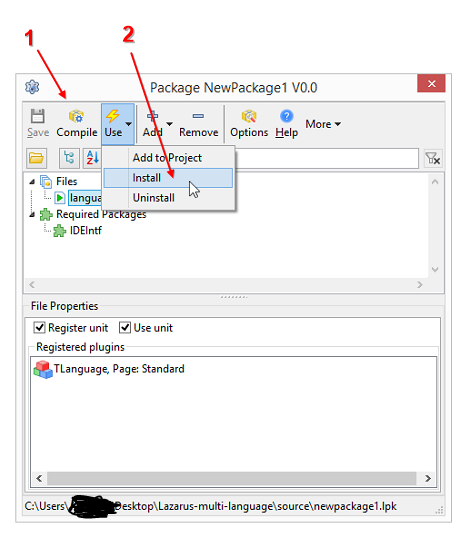
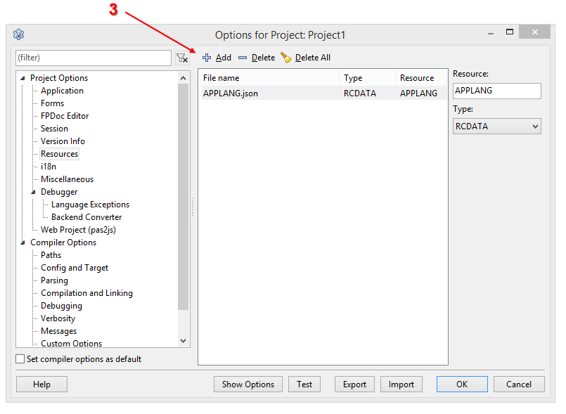

# Lazarus multi language

## This is simple multi language for Lazarus version

---
## How to use

Step1 : Open source file newpackage1.lpk to compile component.

Step2 : Install Component.

--

Step3: Create an language file name as "APPLANG.json", view the demo folder.

Step4: Open project as demo, menu->select project options-->Resources-->add "APPLANG.json" file.

And Resources name: "APPLANG", Resources type: RCDATA

Step5: Open demo code.

----

## Why not use Lazarus default i18n!

Yeah, use resources file can easy to compile, and use in few built-in variable for application.

----

LICENSE: FREE
